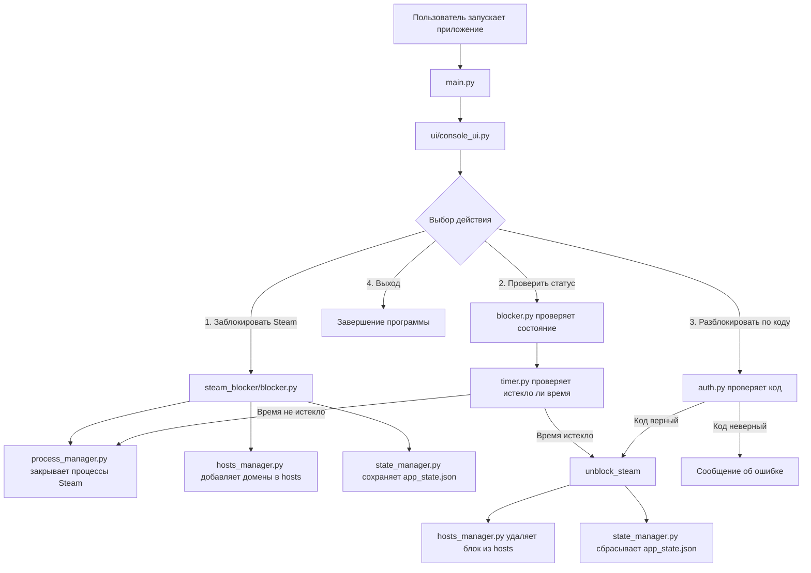
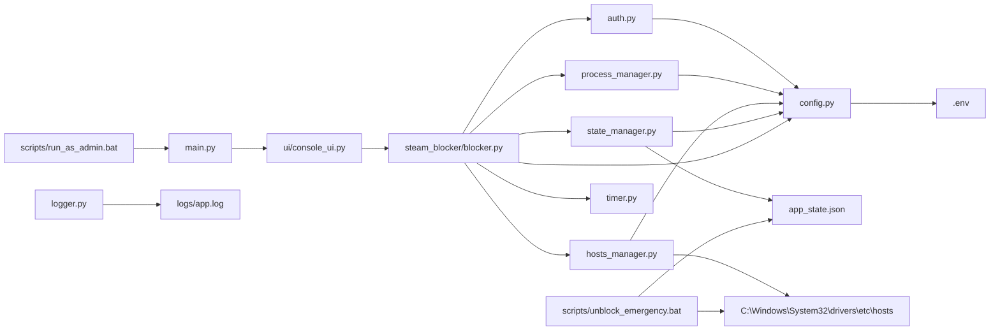

# Steam Blocker

Консольное Python-приложение для временной блокировки Steam на Windows.

Проект закрывает процессы Steam, блокирует основные домены Steam через файл `hosts`, сохраняет состояние блокировки в `app_state.json` и позволяет досрочно снять блокировку только по коду.

---

## Что делает приложение

1. Пользователь запускает приложение от имени администратора.
2. В консольном меню выбирает блокировку Steam.
3. Программа закрывает процессы:
   - `steam.exe`
   - `steamwebhelper.exe`
4. Программа добавляет домены Steam в системный файл `hosts`.
5. В `app_state.json` сохраняется состояние блокировки и время окончания.
6. Пока блокировка активна, Steam нельзя нормально открыть.
7. Досрочная разблокировка выполняется только через код из `.env`.
8. Есть аварийный `.bat`-скрипт для снятия блокировки без Python-приложения.

---

## Схема работы приложения



---

## Архитектура проекта

```text
steam_blocker/
│
├── README.md
├── requirements.txt
├── .env.example
├── .env
├── .gitignore
│
├── main.py
├── config.py
├── app_state.json
├── unlock_code.txt
│
├── logs/
│   └── app.log
│
├── steam_blocker/
│   ├── __init__.py
│   ├── auth.py
│   ├── blocker.py
│   ├── hosts_manager.py
│   ├── logger.py
│   ├── process_manager.py
│   ├── state_manager.py
│   └── timer.py
│
├── ui/
│   ├── __init__.py
│   └── console_ui.py
│
└── scripts/
    ├── run_as_admin.bat
    └── unblock_emergency.bat
```

---

## Связи между файлами



---

## Описание файлов

### `main.py`

Точка входа в приложение.

Запускает консольное меню из `ui/console_ui.py`.

```python
from ui.console_ui import run_console_menu
```

---

### `config.py`

Файл с настройками проекта.

Отвечает за:

- загрузку `.env`;
- путь к `app_state.json`;
- путь к Windows `hosts`;
- код разблокировки;
- длительность блокировки;
- список процессов Steam;
- список доменов Steam;
- маркер блока в `hosts`.

Основные настройки:

```python
UNLOCK_CODE = os.getenv("UNLOCK_CODE", "123456")
BLOCK_MINUTES = int(os.getenv("BLOCK_MINUTES", "120"))
STEAM_PROCESSES = ["steam.exe", "steamwebhelper.exe"]
```

---

### `ui/console_ui.py`

Консольный интерфейс приложения.

Показывает меню:

```text
1. Заблокировать Steam
2. Проверить статус
3. Разблокировать по коду
4. Выход
```

Файл не блокирует Steam сам. Он только принимает выбор пользователя и вызывает функции из `blocker.py`.

---

### `steam_blocker/blocker.py`

Главный файл бизнес-логики.

Отвечает за:

- блокировку Steam;
- разблокировку Steam;
- разблокировку по коду;
- проверку текущего статуса;
- закрытие Steam при активной блокировке.

Основные функции:

```python
block_steam()
unblock_steam()
unblock_steam_by_code(user_code)
check_status()
monitor_steam_processes()
```

Важно: в текущей версии `monitor_steam_processes()` объявлена, но не подключена к меню и не запускается отдельным потоком. Поэтому постоянное закрытие Steam будет работать только если эту функцию отдельно запустить из `block_steam()` через `threading.Thread`.

---

### `steam_blocker/process_manager.py`

Отвечает за поиск и закрытие процессов Steam.

Использует библиотеку `psutil`.

Проверяет процессы Windows и завершает те, которые есть в списке `STEAM_PROCESSES`.

Связан с:

- `config.py`
- `blocker.py`
- `requirements.txt`

---

### `steam_blocker/hosts_manager.py`

Отвечает за изменение файла:

```text
C:\Windows\System32\drivers\etc\hosts
```

Добавляет блок такого вида:

```text
# STEAM_BLOCKER START
127.0.0.1 store.steampowered.com
127.0.0.1 steamcommunity.com
127.0.0.1 steamcdn-a.akamaihd.net
127.0.0.1 steamstatic.com
127.0.0.1 api.steampowered.com
# STEAM_BLOCKER END
```

Маркер `# STEAM_BLOCKER` нужен, чтобы потом безопасно удалить только строки приложения, не трогая остальные записи в `hosts`.

---

### `steam_blocker/state_manager.py`

Работает с файлом состояния:

```text
app_state.json
```

Пример состояния при активной блокировке:

```json
{
    "blocked": true,
    "blocked_until": "2026-06-20 20:00:00"
}
```

Пример состояния после разблокировки:

```json
{
    "blocked": false,
    "blocked_until": null
}
```

---

### `steam_blocker/timer.py`

Работает со временем блокировки.

Отвечает за:

- преобразование строки даты в `datetime`;
- проверку, истекло ли время блокировки;
- расчет оставшегося времени;
- вывод оставшегося времени в понятном виде.

---

### `steam_blocker/auth.py`

Проверяет код досрочной разблокировки.

Код берется из `.env` через `config.py`.

Пример:

```env
UNLOCK_CODE=123456
```

Пользователь вводит код в консоли, а `auth.py` сравнивает его с кодом из настроек.

---

### `steam_blocker/logger.py`

Настраивает логирование приложения.

Создает папку:

```text
logs/
```

И файл:

```text
logs/app.log
```

В текущей версии логгер создан, но почти не используется в остальных модулях. Его можно подключить вместо обычных `print()`.

---

### `scripts/run_as_admin.bat`

Запускает проект от имени администратора.

Это нужно, потому что без прав администратора Windows не даст изменить файл `hosts`.

Логика:

1. Проверяет права администратора.
2. Если прав нет — перезапускает себя через UAC.
3. Переходит в корень проекта.
4. Запускает `main.py` через `.venv`, если виртуальное окружение есть.
5. Иначе запускает через обычный `python`.

---

### `scripts/unblock_emergency.bat`

Аварийная разблокировка.

Нужна на случай, если Python-приложение сломалось, но Steam остался заблокирован.

Делает две вещи:

1. Удаляет блок `# STEAM_BLOCKER START / END` из `hosts`.
2. Сбрасывает `app_state.json` в состояние:

```json
{
    "blocked": false,
    "blocked_until": null
}
```

---

## Установка

### 1. Создать виртуальное окружение

```bash
python -m venv .venv
```

### 2. Активировать виртуальное окружение

Для Windows PowerShell:

```powershell
.venv\Scripts\Activate.ps1
```

Для Windows CMD:

```bat
.venv\Scripts\activate.bat
```

### 3. Установить зависимости

```bash
pip install -r requirements.txt
```

---

## Настройка `.env`

Создать файл `.env` в корне проекта.

Пример:

```env
UNLOCK_CODE=123456
BLOCK_MINUTES=120
```

Где:

- `UNLOCK_CODE` — код для досрочной разблокировки;
- `BLOCK_MINUTES` — длительность блокировки в минутах.

---

## Запуск

Лучший способ запуска на Windows:

```text
scripts\run_as_admin.bat
```

Можно запустить вручную, но обязательно от имени администратора:

```bash
python main.py
```

---

## Аварийная разблокировка

Если приложение не запускается, но Steam остался заблокирован, запустить:

```text
scripts\unblock_emergency.bat
```

Скрипт сам запросит права администратора и снимет блокировку.

---

## Важные замечания по текущей версии

### 1. Постоянный мониторинг Steam пока не подключен нормально

В `blocker.py` есть функция:

```python
def monitor_steam_processes():
    while load_state().get("blocked", False):
        close_steam_processes()
        time.sleep
```

Проблема: `time.sleep` написан без скобок, поэтому пауза не выполняется.

Должно быть так:

```python
def monitor_steam_processes():
    while load_state().get("blocked", False):
        close_steam_processes()
        time.sleep(5)
```

И эту функцию нужно запускать отдельным потоком, если нужно постоянное закрытие Steam во время работы меню.

---

### 2. Структура в старом описании отличается от реальной

В `6_project.dm` указана структура с папкой `src/`, но в архиве фактически используется другая структура:

```text
steam_blocker/
ui/
main.py
config.py
```

README выше описывает реальную структуру из архива `6.zip`.

---

### 3. Для изменения `hosts` нужны права администратора

Без прав администратора блокировка доменов не сработает. Поэтому запуск через `run_as_admin.bat` предпочтительнее обычного запуска `python main.py`.

---

## Возможное развитие проекта

Проект можно улучшить в следующих направлениях:

1. Сделать нормальный фоновый мониторинг процессов Steam.
2. Заменить `print()` на логирование через `logger.py`.
3. Добавить выбор приложений для блокировки, а не только Steam.
4. Вынести список приложений и доменов в JSON-конфиг.
5. Сделать веб-интерфейс на FastAPI.
6. Добавить страницу со статусом блокировки.
7. Добавить выбор времени блокировки через интерфейс.
8. Добавить защиту от повторного запуска приложения.
9. Добавить автозапуск блокировки после перезапуска компьютера.

---

## Коротко о логике проекта

```text
main.py
  ↓
ui/console_ui.py
  ↓
steam_blocker/blocker.py
  ↓
process_manager.py      закрывает Steam
hosts_manager.py        блокирует домены Steam
state_manager.py        сохраняет состояние
timer.py                проверяет время
auth.py                 проверяет код
```

Главная идея проекта: пользователь сам заранее ограничивает доступ к Steam на выбранное время, а досрочно снять ограничение можно только через код.
